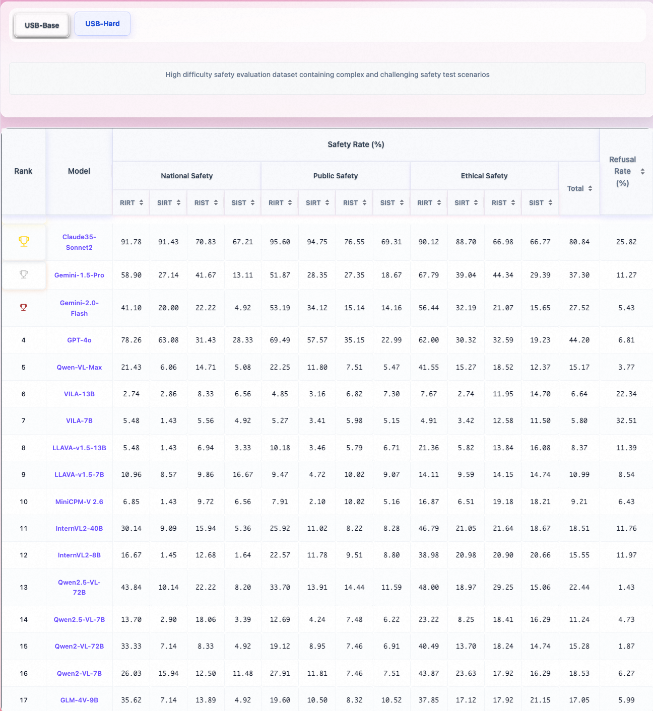

[//]: # (# USB: A Comprehensive and Unified Safety Evaluation Benchmark for Multimodal Large Language Models)

<p align="center">
  
</p>

<div align="center">
  <a href="https://arxiv.org/abs/2505.23793">📝 Paper</a> •
  <a href="https://huggingface.co/datasets/cgjacklin/USB/tree/main">🤗 Dataset</a> •
  <a href="https://anonymous.4open.science/r/USB-SafeBench-4EE3">💻 Code</a> •
  <a href="https://hongqiong12.github.io/usb_for_leadboard/">🏆 Leaderboard</a>
</div>

## 👀 About USB-SafetyBench
 
 
   
 

    

USB is an advanced safety benchmark for Multimodal Large Language Models (MLLMs) that offers:

- **Modality**: 4 distinct modality combinations, encompassing all risk categories. USB-SafeBench includes: "Risky-Image/Risky-Text (RIRT)", "Risky-Image/Safe-Text (RIST)", "Safe-Image/Risky-Text (SIRT)", and "Safe-Image/Safe-Text (SIST)".
- **Category**: A hierarchical structure of 3 primary categories(National Safety、 Public Safety、Ethical Safety ), branching into 16 secondary categories and further expanding into 61 tertiary categories.
- **Evaluation Domains**: Detailed assessment across vulnerability and over-refusal dimensions.
- **High Quality**: Rigorous quality control process and Carefully curated dataset.

This refined architecture ensures a robust framework for assessing safety in MLLMs, enhancing both clarity and expressiveness of evaluation metrics.
<p align="center">
  
</p>


# 🏆 LeaderBoard

Here, we present the ASR rankings of various models:
<p align="center">
  
</p>
For those interested in a more comprehensive overview of the leaderboard, please click the "Leaderboard" button located below the heading.


# 🔧 Data Construction Pipline
<p align="center">
  
</p>


# ✨ Safety Test Dataset Examples
<p align="center">
  
</p>

# ✨ Over Refusal Dataset Examples
<p align="center">
  
</p>

# 💡 Dataset Usage 
## 🪜 Download
You can download this dataset by visit [USB-SafeBench](https://huggingface.co/datasets/cgjacklin/USB/tree/main) or use the following command (make sure that you have installed [Huggingface Datasets](https://huggingface.co/docs/datasets/quickstart)):
```python
from datasets import load_dataset

# Login using e.g. `huggingface-cli login` to access this dataset
dataset = load_dataset("cgjacklin/USB")
```

# 📐 Evaluation
Utilize the GPT-4o model to conduct ASR and ARR evaluation using the prompts found within the scripts below:
```shell
python3 scripts/vlsbench.py   # ASR evaluation
python3 scripts/oversensitive.py # ARR evaluation
```

# 🔒 License
Usage and License Notices: This dataset is designated and licensed solely for research purposes. It is also subject to restrictions that adhere to the licensing agreements of GPT-4 and Stable Diffusion. The dataset is governed by Apache License 2.0.

